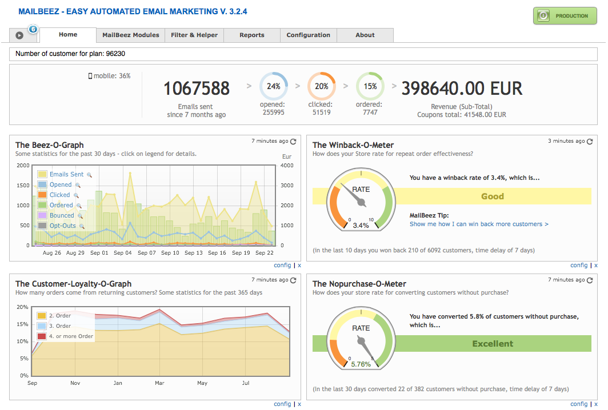

---
# http://learn.getgrav.org/content/headers
title: Guide to Getting Started
slug: guide-to-getting-started
routes:
    aliases:
        - /documentation/tutorials/guide-to-getting-started/
        
date: 10-11-2010
published: true
publish_date: 10-11-2010
template: tutorial
visible: true
summary:
    enabled: true
    format: short
    size: 128
taxonomy:
    migration_status: done
    category: [docs]
    tag: []
author:
    name: admin
metadata:
    author: admin
---

[TOC]

## Welcome to the Guide to Getting Started!

##### More Revenue – less work

MailBeez gives you and your business the tools to create personalized, fully automated email campaigns, right from within your store’s existing admin interface.

##### Easy Installation, rock-solid operation

MailBeez is designed for easy installation, configuration and rock-solid operation. It works with read-only access to your existing shop-database tables and also maintains its own database tables, like for example, remembering which customer has already received a certain email.

**Not yet installed?** If you have not yet done so, please [install the MailBeez System.](/documentation/installation)

 
## Step 1: Learn All About MailBeez

>>>>>>Use the build-in tours to get guided around within the MailBeez system. You will find all available tours in the first tab.

#### The MailBeez Dashboard

Once you install MailBeez, you will have a new Mailbeez link in your admin which you can use to navigate to your MailBeez Dashboard. Access this area and take a few moments to browse around.





#### Mode Indicators

By default MailBeez is placed in **Simulation Mode**, which is indicated by the orange “Simulation” button in the upper right corner of the interface and can be seen throughout the MailBeez interface. The mode is also clearly displayed in the MailBeez Dashboard with a big bold button. Clicking this button not only changes the mode you’re in, but it also changes the button accordingly, so you know from a quick glance at your MailBeez Dashboard which mode you’re in:


When MailBeez is in Simulation Mode, you can freely play around with MailBeez and learn what you can edit, touch, and change with full confidence that your customers will not receive any emails as a result of your playing and testing.

#### Navigation Tabs

Across the top of the interface, you will see a number of tabs which group common functionality and settings:

- **Tour -** Start intactive guided Tours
- **Home -** get a quick overview how MailBeez works for you
- **MailBeez Modules -** This houses all of your MailBeez email modules. Go here to configure, test, and run these modules.
- **Filter & Helper -** This houses all of your MailBeez filter & helper modules. Go here to configure, test, and run these modules.
- **Reports -** All of your MailBeez reports are located in this tab. Go here to activate & view your MailBeez reports.
- **Configuration -** Here you will find all of the configuration settings for the MailBeez framework, as well as extra configuration settings for various premium modules.
- **About -** Here you will find information about MailBeez, links to rate MailBeez, view ratings, request a feature, and the domain information you will need when you purchase premium modules.

#### Beez-O-Graph With MailBeez Analytics Data

The Beez-O-Graph is a powerful widget with an intuitive graph display that provides you with a visual report of your daily MailBeez Analytics data, such as number of emails sent, number of emails opened, number of email links clicked, number of products ordered as a result of your emails, and number of customer opt-outs. By default, it displays 30 days worth of data, but this number of days can be changed in the Beez-O-Graph configuration settings.

When MailBeez is first installed, there won’t be a graph displayed by this widget because there has been no data tracked and therefore nothing to display. Once you get your MailBeez email campaigns up and running, this widget will be populated with data in no time at all!

#### The Review-O-Meter

The Review-O-Meter is a powerful dashboard widget that lets you know how many customers are writing reviews of their purchases as a result of your Mailbeez Review Reminder email campaign. By default, it tracks & displays results for 30 days worth of data, but this number of days can be changed in the Review-O-Meter configuration settings.

Additionally, you can set your review goals based on your industry standards, product demand, and customer review patterns. The number you enter into this configuration setting is the percentage of reviews you hope to receive in relation to the number of Review Reminder emails sent. This setting has a direct impact on the behavior of the widget’s success measurement needle, so you’ll want to make this goal a reasonable one.

When MailBeez is first installed, the widget will show you that your review rate is in the “orange zone” because it doesn’t take into account any reviews that were written prior to installation. Once you start running your Review Reminder campaign and give it some time, you should see the needle start to rise so long as your review goal is reasonable. For example, if you set the percentage to 100, your widget will always be in the “orange zone” because this is a lofty and possibly unattainable goal. Start small and set your goals higher as the smaller ones are attained.

#### The Winback-O-Meter

The Winback-O-Meter is a powerful dashboard widget that lets you know how many customers you’ve successfully caused to do repeat business with you as a result of your Mailbeez Winback email campaign. By default, it it tracks & displays results for 30 days worth of data, but this number of days can be changed in the Winback-O-Meter configuration settings.

Additionally, you can set your winback goals based on your industry standards, product demand, and customer repeat-business patterns. The number you enter into this configuration setting is the percentage of repeat business orders you hope to achieve in relation to the number of Winback emails sent. This setting has a direct impact on the behavior of the widget’s success measurement needle, so you’ll want to make this goal a reasonable one.

When MailBeez is first installed, the widget will show you that the rate of your repeat business is in the “orange zone”, because it doesn’t take into account any customers who have done repeat business prior to installation. Once you start running your Winback campaign and give it some time, you should see the needle start to rise so long as your winback goal is reasonable. For example, if you set the percentage to 100, your widget will always be in the “orange zone” because this is a lofty and possibly unattainable goal. Start small and set your goals higher as the smaller ones are attained.

#### The Nopurchase-O-Meter

The Nopurchase-O-Meter is a powerful dashboard widget that lets you know how many customers with no prior purchases were converted into purchasing customers as a result of your Mailbeez Nopurchase email campaign. By default, it tracks & displays results for 30 days worth of data, but this number of days can be changed in the Nopurchase-O-Meter configuration settings.

Additionally, you can set your conversion goals based on your industry standards, product demand, and customer conversion patterns. The number you enter into this configuration setting is the percentage of conversions you hope to achieve in relation to the number of Nopurchase emails sent. This setting has a direct impact on the behavior of the widget’s success measurement needle, so you’ll want to make this goal a reasonable one.

When MailBeez is first installed, the widget will show you that your customer conversion rate is in the “orange zone”, because it doesn’t take into account any customer conversions that took place prior to installation. Once you start running your Nopurchase campaign and give it some time, you should see the needle start to rise so long as your conversion goal is reasonable. For example, if you set the percentage to 100, your widget will always be in the “orange zone” because this is a lofty and possibly unattainable goal. Start small and set your goals higher as the smaller ones are attained.

#### The Loyalty-O-Graph

The Loyalty-O-Graph is a powerful dashboard widget with an intuitive graph display that provides you with a visual report of how many orders come from returning customers. Because it tracks total repeat business without regard to the MailBeez Winback campaign modules, you can use the data this widget reports to compare against the data from the Winback widget to see how much of your repeat business is a result of your Winback email campaign. By default, it displays 365 days worth of data, but this number of days can be changed in the Loyalty-O-Graph configuration settings.

When MailBeez is first installed, this widget analyzes the database of orders for recurring orders and populates right away. Handy!

#### The Google-Analytics-O-Pie

**Tip:** You must have a Google Analytics account set up and have it activated & configured in MailBeez for this widget to function.

The Google-Analytics-O-Pie is a powerful widget that provides you with a visual report in the form of a pie chart of all the MailBeez activity data that Google Analytics tracks for you, such as site visits resulting from MailBeez email campaigns, revenue earned with MailBeez, and a breakdown of that revenue by module so that you can see which modules are working hardest for you! By default, it tracks & displays results for 30 days worth of data, but this number of days can be changed in the Google-Analytics\_O-Pie configuration settings.

When MailBeez is first installed, there won’t be a pie chart displayed by this widget because there has been no data tracked and therefore nothing to display. Once you get your MailBeez email campaigns up and running, and configure your built-in Google Analytics settings to begin tracking MailBeez activities, this widget will be populated with data in no time at all!


## Step 2: Send Your First Test Email

1. Navigate to admin > MailBeez Interface > MailBeez Modules tab > Birthday Greetings
2. Click on the “Install” button
1. This will bring up the Birthday Greetings module configuration panel.
2. Go to “Activate Module”, click “True”, & click “Update” to turn the module on.

The remaining configuration settings are fine for testing purposes.

1. Preview the email templates to get an idea of what the default email templates look like:
   Placeholder content like ‘{$firstname}’ for example, show you where the dynamic data will be inserted in the final email. This placeholder content does not display in the email when the module is run. Instead, it is replaced with the information it represents (such as the customer’s first name, for example), as you will see in the next step when you send a test email.

1. Send a test email

   When you click on the send button, you will get a popup screen in which you’ll be able to enter the email address where you want the test email to go to.

 **ZenCart**: It is a good idea to send a test email to an email address which is configured to receive email in HTML format, and send a second test email to an email address which is configured to receive email in TXT only format. This way, you can see what your customers will see whether they are receiving mail in HTML or TXT format. This process ensures both your HTML and TXT format emails look sharp & professional.


## Step 3: Style Your Templates to Reflect Your Brand

The MailBeez email template system is designed to let you control everything about the design, layout, and content of your emails, so that you can customize them to reflect your brand and the personality of your store. Mailbeez emails are 100% template based, and therefore can be customized without any programming knowledge whatsoever. As long as you are comfortable with a little HTML editing, you will be able to make changes to Mailbeez templates or even create your own.

Whether you are using MailBeez free email templates or MailBeez premium email templates, the email template system is structured to use global templates that affect all emails, as well as sub-templates which are specific to each MailBeez module. Some of the customizations you make will be on a global scale whilst others are made on a per-module basis.

#### Try a Global Customization – Change the Email Header Image


>>>>>>[plugin:content-inject](/content_blocks/pro_template_manager)

No doubt you will want to replace the template email header with an email header of your own. This will be a global customization as you want it to affect every email MailBeez generates. Follow these simple steps:

- Create a new image with a width of 600px
- Name the new image. For example “`mynewheader.png? ”
- Using your preferred FTP program, upload the new image to “`/mailhive/common/images/`”
- Edit the Common Main Template located  `/mailhive/common/templates/email_html.tpl`  
 as indicated below
- Find the line of code which defines the email header image:
   ```
   
   ```
- Edit the code shown above to reflect the new image name to get this: 
   ```
   
   ```


#### Try a Per-Module Customization – Change the Module Graphic

>>>>>>[plugin:content-inject](/content_blocks/pro_template_manager)

Using the Birthday Greeting module as an example, let’s say you want to change the ‘Happy Birthday’ graphic and it’s layout. Follow these simple steps:


- Create a new image, sized 256px by 256px
- Name the new image. For example “`balloons.png`”
- Using your preferred FTP program, upload the new image to  ”catalog/mailhive/mailbeez/birthday/images/”
- Edit the Birthday Greeting email template `/mailhive/mailbeez/birthday/email/body_html.tpl` as indicated below
- Find the line of code which defines the Birthday Greeting image:
   ```
   
   ```
- Edit the code shown above to reflect the new image name and location within the layout to get this:
   ```
   
   ```
   

#### More Information About MailBeez Email Template Modules
When you’re ready to see more examples or make more customizations to your email templates, check out our detailed tutorials:

Edit your templates right from your shop admin with the MailBeez Template Manager. A simple drop-in Installation means you can begin editing template files from your admin in minutes! [Visit the module now](/documentation/configbeez/config_tmplmngr/)

All premium email module templates come packaged without the MailBeez Copyright Notice so you can truly brand the emails these modules generate. If you would like to have the additional footer containing the MailBeez Copyright Notice removed from the free email module templates, you may do so by either upgrading the free module to the premium version, or by purchasing the [MailBeez Copyright Remover Certificate](/documentation/configbeez/config_copyright_remover/)


## Step 4: Download & Install Additional Modules


>>>>>>[plugin:content-inject](/content_blocks/pro_install_easy)

The easiest way to browse for additional modules that might interest you is to use the Version Check Widget on the MailBeez Dashboard to bring up the AppStore.

Begin by clicking on the “Check for Update” button and the software will automatically check itself for updates & additional module opportunities. You will see the widget change to provide color-coded information: orange for updates and blue for newly released modules you may want to consider installing.


Notice also the color-coded indicators on the tabs which alert you to updates and new modules by category.

Clicking on any tab displaying blue indicators will result in being taken into that tab where you’ll see the Appstore displaying all of the available modules in that category which you have not yet installed.

From here, you can click on the modules that interest you to be taken right to the module’s documentation page where you can read more about it, download it if it’s a free module, or click the purchase link if it’s a premium module. Handy!

MailBeez is in the process of creating step-by-step configuration tutorials for all of our modules, both premium & free, so you can download with confidence! Check back often – the tutorials page is updated as tutorials become available. [MailBeez Modules Configuration Tutorials](/documentation/tutorials/)


## Next Steps

#### Configure MailBeez

In most cases the default configuration settings are sufficient for you to begin testing, however there are a couple settings which you’ll need to configure before you can begin testing, such as the “Send Copy to” and “Send Simulation to” email addresses.

Configuration is easy with our step-by-step configuration tutorials! Begin with the Quick Start Configuration Tutorial to prepare your MailBeez installation for testing. When you’ve completed testing and are ready to go live, use our Comprehensive Configuration Tutorial to ensure all of your settings are as you want them before you switch over to Production Mode.

- [Quick Start Configuration Tutorial](/documentation/tutorials/mailbeez-quick-start-configuration-tutorial/)
- [Comprehensive Configuration Tutorial](/documentation/tutorials/mailbeez-comprehensive-configuration-tutorial/)

#### Run MailBeez Automatically

MailBeez can be run daily by processing of each MailBeez module manually – which might become quite time consuming. Therefore it is much better to set up a cronjob to run Mailbeez each day, allowing you to truly ‘set and forget’ Mailbeez once it is installed. If you don’t want to spend hours learning how to set up a Cronjob, then the “Run MailBeez Automatically” module is perhaps the ideal solution for most stores to automate MailBeez.

- [Install the simple and affordable Run MailBeez Automatically module](/documentation/configbeez/config_cron_simple/)

To get started, first download the module, follow the easy installation instructions and set “time between running MailBeez (hours)” to “12″. Now your MailBeez will be processed twice a day, catching the optimum amount of customers for each active module!

#### Activate Production Mode

Once you have completed testing, email template customization, and a complete configuration of your installation, you will be ready to switch from Simulation Mode to Production Mode and begin sending your first email campaign! This can be done in the Configuration tab in the MailBeez interface.


#### Keep MailBeez Up to Date

The MailBeez Check for Updates email module allows you to configure MailBeez to check for updates on a regular basis and send the results to you in a nicely formatted email. If you have a webmaster or admin who is responsible for managing the back-end of your store, you can configure this module to send the results report directly to them!


