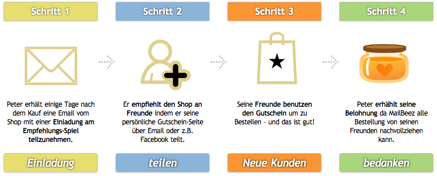

---
# http://learn.getgrav.org/content/headers
title: Neukunden-Gewinnungssystem "ReferralHoney"
slug: coupon_referral_honey
# menu: Neukunden-Gewinnungssystem "ReferralHoney"
date: 10-01-2012
published: true
publish_date: 10-01-2012
# unpublish_date: 10-01-2012
template: docs
# theme: false
visible: true
summary:
    enabled: true
    format: short
    size: 128
taxonomy:
    migration_status: done
    category: [docs]
    tag: [pro,coupon]
module:
    code: 'coupon_referral_honey'
    category: [mailbeez]
    compatiblity: [comp_cre,comp_zencart,comp_xtc,comp_gambio]
    thumbnail: 'http://www.mailbeez.com/wp-content/uploads/downloads/thumbnails/2012/01/icon_32.png'
    pro: 'pro'
    cert: 'true'
    price: '299 EUR'
    title_en: 'MailBeez ReferralHoney'
    teaser_en: 'make every customer a markeeter'
    title_de: 'Neu-Kundenspiel "ReferralHoney"'
    teaser_de: 'Viraler Effekt durch Social Sharing bringt Neu-Kunden'
    author: 'MailBeez.com'
# added collection selector

author:
    name: admin
metadata:
    author: admin
#      description: Your page description goes here
#      keywords: HTML, CSS, XML, JavaScript
#      robots: noindex, nofollow
#      og:
#          title: The Rock
#          type: video.movie
#          url: http://www.imdb.com/title/tt0117500/
#          image: http://ia.media-imdb.com/images/rock.jpg
#  cache_enable: false
#  last_modified: true
---

Kunden werben Kunden:

<!--
[Besuchen Sie die MailBeez ReferralHoney Mini-Site für mehr Informationen](/download/mailbeez-referral-honey/ "The MailBeez ReferralHoney")
-->

**ReferralHoney ist ein voll automatisches Neukunden-Empfehlungssystem für MailBeez. Kunden empfehlen den Shop an Freunde oder Familie und erhalten einen Belohnungs-Gutschein, wenn ein oder mehr Freunde eine Bestellung tätigen – ein Kreislauf, der zu neuen Kunden führt!**

So funktioniert MailBeez ReferralHoney:

ReferralHoney gibt jedem Ihrer Kunden die Möglichkeit und einen Anreiz neue Kunden für Sie zu finden. Um die bekannte Wirkung von persönlichen Empfehlungen zu entfalten, versendet ReferralHoney eine Einladungs-Email mit einem Link zu einer personalisierten Empfehlungsseite. Der Kunde kann diese Empfehlungsseite mit einem Klick an seine Freunde, Familie, Vereinskameraden oder Kollegen weitergeben, da er weiss, dass eine Belohnung auf ihn wartet. Die Empfehlungsseite ist bereits mit Facebook, Twitter und Google+ integriert – Die Empfehlung ist also mit wenigen Klicks erledigt!

Facebook: Der eingeladene Kunde kann seine persönliche Share-Page mit einem Klick auf Facebook teilen.

Twitter: Die persönliche Share-Page erlaubt es auch, innerhalb von Sekunden einen neuen Tweet zu senden

E-Mail: Und natürlich kann der Link zur persönlichen Share-Page auch per Email, Chat oder andere Wege an Freunde weitergegeben werden.

**Automatisiert und personalisiert**

Einrichten und vergessen: Einmal installiert wird ReferralHoney – wie alle MailBeez Module bei entsprechender Konfiguration – voll automatisch laufen und Emails, Gutschein und Belohnungen erstellen, versenden und nachverfolgen.
Als MailBeez-Modul ist die Installation in kurzer Zeit erledigt und ausser der Individualisierung der Vorlagen und Einstellungen ist nichts am Shopsystem zu ändern!
MailBeez ReferralHoney bietet eine Reihe von Konfigurationsmöglichkeiten, um die persönliche Marketingstrategie Ihres Shops zu unterstützen, dies kann z.B. der zeitliche Abstand des Versandes der Einladung nach der Bestellung sein, der erforderliche Bestell-Status oder auch der Wert des Empfehlungsgutscheins. Wenn es zur Belohnung der fleissigen Empfehler kommt (natürlich auch automatisch), können Sie in drei Stufen eine Staffelung einrichten. Wenn von Peters Freunden z.B. drei bestellen, kann Peter eine größere Belohnung erhalten, als wenn nur zwei bestellen.

Wir empfehlen, den MailBeez Service für die Einrichtung, Konfiguration und Inbetriebnahme zu buchen.

### Modul Optionen:

**Order-Status of Customer order to start**  
 Choose the order status on which ReferralHoney will begin the referral cycle – we would recommend ‘despatched’, or your store equivalent.

**Set Order Status for friends order to recognize**  
 Choose the order status on which ReferralHoney will recognize an order from a referrer’s friend – we would recommend ‘despatched’, or your store equivalent.

**Delay after order**  
 The number of days after your customer’s last order before it qualifies for a ReferralHoney invitation.

**Set number of days to skip processing**  
 The number of days after processing is skipped (depending how often you run MailBeez). This number must be bigger then “Delay after order”

**Delay since last invite**  
 Delay since a customer was invited to join the referral scheme – set this to over 7 days if you have customers that order very regularly to ensure that multiple invitations are not sent out.

**Share-Coupon: Expires after days**  
 The number of days after which the initial share coupon expires – calculated from the sending point in time.

**Reward-Coupon: Expires after days**  
 The number of days after which the reward coupon expires – calculated from the sending point of time.

**Length of Coupon Code**  
 Sets the length of the automatically generated coupon code

**Sender email**, **Sender name**  
 Sets the from email address and name in each ReferralHoney email. Typically you would want to use your store’s most used email address and name to ensure high delivery rates.

 

### Options for Invite

**Delay after order** (same as in General Options)  
 The number of days since last order

**Coupon Template – Friends Coupon for sharing**  
 Choose the coupon code template you have configured in the coupon system. This coupon will be used as template to generate a personalized, unique coupon. The coupon code must start with ‘*template\_*‘ e.g. ‘*template\_game*‘

>>>>> When setting up the ReferralHoney refer a friend coupon template, please make sure to leave the usage field blank, or for example enter a number of at least 50. If we take this scenario as an example, the customer who receives the coupon to share with their friends is always marked as having used the coupon (so only their friends can use it), leaving 49 more uses available.The number of usages per customer field should be set to 1 – the refer a friend coupon is automatically marked as used by the referring customer when it is sent, which makes sure the coupon is only used by newly referred customers and not the initial recipient.

**Share-Coupon: Expires after days** (same as in General Options)  
 The number of days after which the share coupon expires – calculated from the sending point of time.

 

### Options for Order Notification / Recognition

**Set Order Status for friends order to recognize**  
 Set the status of orders to recognize accepted friend orders

 

### Options for Reward

You can set up to 3 levels of rewards, which means that for each level you can define the reward Coupon you would like to give out.

**Delay after Coupon Expiry date**  
 The number of days after the expiry of the friend coupon before sending the reward coupon.

**Number of Orders for Level 1**  
 The number of recognized orders to get reward coupon level 1

**Reward: Choose Coupon as Template for Level 1**  
 Choose the relevant coupon code you have configured in the coupon system. This coupon will be used as template to generate a personalized, unique coupon. The coupon code must start with ‘*template\_*‘ e.g. ‘*template\_reward1*‘

**Number of Orders for Level 2**  
 The number of recognized orders to get reward coupon level 2

**Reward: Choose Coupon as Template for Level 2**  
 Choose the coupon code you have configured in the coupon system. This coupon will be used as template to generate a personalized, unique coupon. The coupon code must start with ‘*template\_*‘ e.g. ‘*template\_reward2*‘

**Number of Orders for Level 3**  
 The number of recognized orders to get reward coupon level 3

**Reward: Choose Coupon as Template for Level 3**  
 Choose the coupon code you have configured in the coupon system. This coupon will be used as template to generate a personalized, unique coupon. The coupon code must start with ‘*template\_*‘ e.g. ‘*template\_reward3*‘

**Reward-Coupon: Expires after days**  
 The number of days after which the coupon expires – calculated from the sending point of time.
